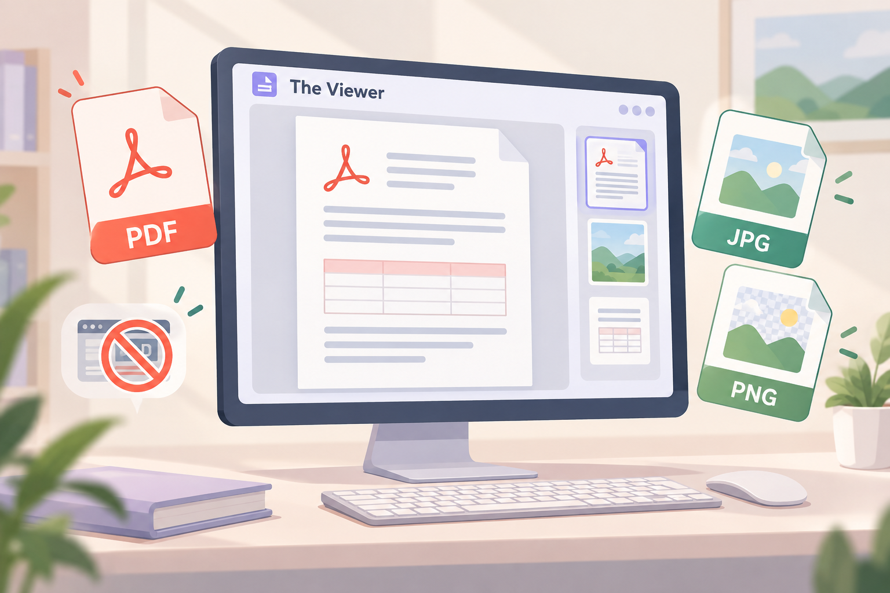
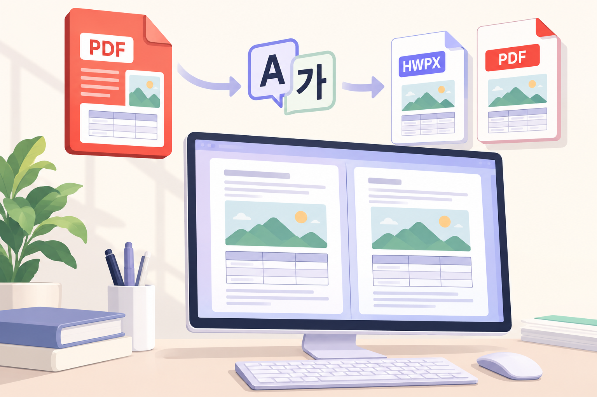

# The Viewer 정

Windows용 PDF·사진 뷰어입니다. 여러 자료의 페이지를 정리하고, PDF의 글자·그림·선을 편집하며, 원본과 수정본을 좌우로 비교할 수 있습니다.

**[다운로드와 버전별 변경사항](https://github.com/faintstar85-source/the-viewer/releases/latest)** · [사용 안내](docs/PROGRAM_GUIDE.md) · [전체 수정 기록](CHANGELOG.md) · [오류 제보와 기능 요청](https://github.com/faintstar85-source/the-viewer/issues) · [개발자 블로그](https://blog.naver.com/faintstar)

## 문서 기준

이 안내는 **The Viewer v3.13.15 소스**를 기준으로 작성했습니다. 실제 공개된 설치 파일과 배포 버전은 [GitHub Releases](https://github.com/faintstar85-source/the-viewer/releases)에서 확인하세요.

일반 사용자는 릴리스에 첨부된 설치 EXE를 사용합니다. 설치 배포본은 Python을 별도로 설치하지 않고 실행할 수 있습니다.

## 최근 반영한 기능

- PDF 글자를 화면에서 바로 수정하고, 글상자의 테두리와 손잡이로 위치·크기를 조절합니다.
- 글상자·그림·선·도형을 복사해 다른 페이지의 같은 X/Y 좌표에 붙여넣습니다. 빈 페이지에도 붙여넣을 수 있습니다.
- 우클릭 드래그로 여러 개체를 선택하고, 왼쪽·가운데 정렬과 가로·세로 간격을 조절합니다.
- 여러 개체를 선택한 바깥 손잡이는 개체 크기를 유지하면서 배치 간격을 조절합니다.
- 조각난 문자는 **글상자 합치기**로 하나의 편집 상자로 만듭니다.
- 듀얼 보기와 1|2 전환 애니메이션의 기본값은 꺼짐이며, 설정에서 켤 수 있습니다.
- 빨간 책 모양 PDF 아이콘의 글자와 테두리를 다듬었습니다.

## 주요 기능

아래 이미지는 기존 기능 설명용 **AI 일러스트**입니다. 실제 프로그램 화면이나 검출 성능을 나타내는 자료는 아닙니다.

### 1. PDF와 사진을 한 화면에서 확인

시작 화면의 **[+]**에 파일을 드롭하거나 더블클릭해 파일을 선택합니다. 썸네일에서 필요한 쪽을 골라 크게 보고, ZIP·CBZ 안의 이미지도 페이지로 읽을 수 있습니다.

TXT·PY·MD 같은 일반 텍스트는 읽기 페이지로 표시하며, 본문을 수정해 텍스트 파일로 저장할 수 있습니다.

[기본 사용 방법](docs/PROGRAM_GUIDE.md) · [지원 형식과 변환](docs/FORMATS_AND_CONVERSION.md)

### 2. 페이지 정리와 PDF 편집

썸네일을 드래그해 순서를 바꾸고 다른 PDF나 사진을 추가합니다. PDF의 글자·그림·선·표 테두리는 **글/그림 편집**에서 선택해 조절합니다.

글상자 안쪽은 글자 입력, 테두리는 이동, 손잡이는 크기 조절에 사용합니다. 여러 개체의 정렬·간격 조절과 다른 페이지에 같은 좌표로 붙여넣기도 지원합니다.

스캔 이미지 안의 문자는 텍스트 개체로 인식하지 않습니다. OCR 편집 기능은 포함되어 있지 않습니다.

[PDF 편집 자세히 보기](docs/PDF_EDITING.md)

### 3. 좌우 듀얼 보기

듀얼 보기에는 두 자료를 비교하는 **A|A 검토 모드**와 같은 작업 목록의 두 쪽을 나란히 읽는 **1|2 두 장 모드**가 있습니다. 모드 버튼을 눌러 전환합니다.

검토 모드에서는 오른쪽에 다른 자료를 열 수 있습니다. 양쪽 클립을 잠그고 동시 이동을 켜면 페이지 이동·확대·스크롤을 함께 조절할 수 있습니다. 오른쪽 보기는 읽기 전용입니다.

[듀얼 보기와 비교 안내](docs/DUAL_VIEW.md)

### 4. 변경이 의심되는 위치 검토

차이 비교는 현재 표시 중인 두 쪽을 대조해 확인할 위치를 원형 후보로 표시합니다. 이전·다음 후보로 이동하며 내용을 확인합니다.

정렬이 불확실한 경우 분석을 보류합니다. 후보가 없다는 이유만으로 문서 전체가 동일하다고 확정하지 않습니다.

[차이 후보와 분석 보류](docs/DUAL_VIEW.md#차이-후보-검토)

### 5. 번역과 한글 변환

DeepL API 키를 설정해 PDF를 한국어로 번역하고, PDF의 글·표·그림을 한글 편집용 문서로 변환할 수 있습니다. 결과 저장 후 원본과 결과를 좌우 검토뷰에서 확인합니다.

번역 문서는 DeepL 서비스로 전송되며 API 이용 조건이 적용됩니다. 한글 간편 보기와 변환 결과는 복잡한 서식에서 원본 배치와 차이가 날 수 있습니다.

[번역·한글 변환·인쇄 안내](docs/FORMATS_AND_CONVERSION.md)

### 6. 설치와 프로그램 내부 업데이트

설치 EXE를 실행하고, PDF/JPG 기본 앱으로 사용할 경우 Windows 기본 앱 설정에서 The Viewer를 선택합니다. 프로그램의 **정 → 업데이트**에서도 새 버전을 확인할 수 있습니다.

ZIP 배포본은 압축을 풀고 동봉 파일을 함께 유지합니다. 소스 빌드와 GitHub 업로드는 별도의 제작자 안내를 참고하세요.

[설치·업데이트 안내](docs/INSTALL_AND_UPDATE.md) · [패키징·GitHub 업로드](docs/BUILD_AND_GITHUB.md)

## 지원 형식

| 구분 | 확장자 예 | 방식 |
| --- | --- | --- |
| PDF | `.pdf` | 보기·페이지 정리·글자/그림/선 편집 |
| 이미지 | `.jpg` `.jpeg` `.png` `.webp` `.tif` `.tiff` `.bmp` `.gif` | 직접 보기 |
| 압축 이미지 | `.zip` `.cbz` | 압축파일 안의 이미지를 페이지로 보기 |
| 일반 텍스트 | `.txt` `.py` `.md` `.log` 등 | 페이지 읽기·원본 텍스트 편집/저장 |
| 한글 문서 | `.hwp` `.hwpx` | PDF로 간편 변환해 보기 |
| Office 문서 | `.doc` `.docx` `.xls` `.xlsx` `.ppt` `.pptx` 등 | LibreOffice로 PDF 변환 후 보기 |
| CAD·디자인 | `.dxf` `.psd` | 형식별 PDF 변환 후 보기 |

v3.13.15 소스에는 **DWG·AI·EPS·PS 직접 읽기**가 포함되어 있지 않습니다. 해당 문서는 원래 프로그램에서 PDF로 저장해 열어 주세요. GIF의 PDF 저장·인쇄는 첫 프레임을 사용합니다.

## 라이선스

프로그램의 이용·재배포 조건은 권리자가 지정한 라이선스 안내를 확인하세요. 사용하는 외부 라이브러리와 변환 엔진은 각 배포자의 라이선스를 따릅니다.

## 문서와 소스

- [프로그램 사용 안내](docs/PROGRAM_GUIDE.md)
- [수정 기록](CHANGELOG.md)
- [v3.13.15 릴리스 설명](releases/RELEASE_NOTES_v3.13.15.md)
- [뷰어 소스](pdf_page_dragger.py)

